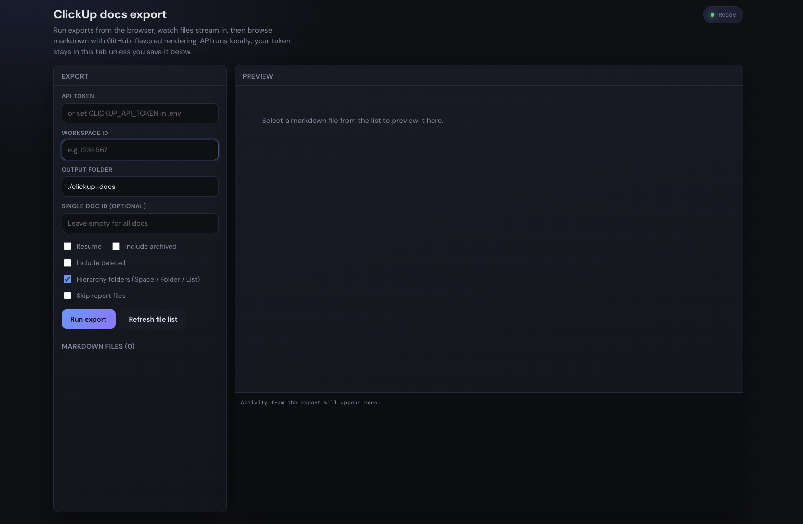

# ClickUp Docs Exporter

A CLI tool (and optional local dashboard) to export your ClickUp Docs and Wikis to markdown files, preserving the full **page** hierarchy inside each doc.

## Credits

This project is based on **[clickup-docs-bulk-export](https://github.com/abderrahmaneMustapha/clickup-docs-bulk-export)** by **Toumi Abderrahmane** ([@abderrahmaneMustapha](https://github.com/abderrahmaneMustapha)). Thank you for the original CLI and idea.

This repository extends that work with: a local web dashboard, richer export reporting, optional ClickUp **Space / Folder / List** folder layout, safer git defaults for the output directory, and related quality-of-life improvements. The original MIT license and spirit of the project are preserved.

## Features

- **Page hierarchy** — Nested pages become nested folders and `.md` files under each doc
- **Two output layouts**
  - **`flat`** (default) — `output/<doc-name>/…` (same as the original behavior)
  - **`hierarchy`** — `output/<space>/<folder?>/<list?>/<doc-name>/…` using each doc’s parent in ClickUp plus the v2 API to resolve names (with collision-safe folder names)
- **Workspace doc list pagination** — Fetches more than the first page of docs from ClickUp
- **Resume mode** — Skip re-downloading page bodies when the target file already exists; optional cached `page_listing` under `.clickup-export/`
- **Export report** — `export-report.json` and `export-report.md` listing problems (and resume skips) after each run
- **Live progress** — Optional `onProgress` hook for tools; the dashboard streams events over SSE
- **Local web dashboard** — Run exports from the browser, watch the activity log, browse `.md` files with rendered preview (GitHub-flavored markdown, sanitized HTML)
- **Frontmatter** — Includes `clickup_doc_id` and `clickup_page_id` where applicable for easier matching and future tooling
- **Rate limits & retries** — Handles 429 and transient 5xx responses
- **Secure token handling** — Token via `.env` (see `.env.example`), `CLICKUP_API_TOKEN`, or `--token`; only sent to ClickUp’s API

## Screenshots

Screenshots are optional. Add images under [`docs/assets/`](docs/assets/) (see that folder’s readme for suggested filenames), then uncomment the lines below.

<!--


-->

## Installation

### Clone and run locally

```bash
git clone <your-repo-or-upstream-url>.git
cd clickup-docs-bulk-export
npm install
cp .env.example .env
# Edit .env and set CLICKUP_API_TOKEN (optional if you always pass --token)
npm run build
```

Then run the CLI (workspace ID is always required):

```bash
node dist/cli.js --workspace YOUR_WORKSPACE_ID
```

You can use `--token` instead of `.env` if you prefer. See `.env.example` for the variable name.

### Global installation (from npm)

If you publish or install from npm:

```bash
npm install -g clickup-docs-exporter
cd /your/project   # optional: directory with a .env file
clickup-docs-exporter --workspace YOUR_WORKSPACE_ID
```

Use `--token` or a `.env` file with `CLICKUP_API_TOKEN` (see the repo’s `.env.example`).

## Web dashboard

Run the API and Vite UI together (from the repo root):

```bash
npm run dashboard
```

- Open **http://127.0.0.1:5173** — UI proxies `/api` to the local server on **8787**
- Set workspace (and token if not in `.env`), choose options, click **Run export**

Single-process mode (build UI first, then one server on **8787**):

```bash
npm run dashboard:serve
```

Then open **http://127.0.0.1:8787**. Override port with `CLICKUP_DASHBOARD_PORT`.

Default export directory is still **`./clickup-docs`**. The repo keeps an empty `clickup-docs/` folder via `.gitkeep`; generated files there are **gitignored** so exports are not committed by accident.

## Usage

### Export all docs from a workspace

```bash
clickup-docs-exporter \
  --workspace 1234567 \
  --output ./clickup-docs
```

With a token from `.env` or `CLICKUP_API_TOKEN`. To pass the token on the command line instead:

```bash
clickup-docs-exporter \
  --token pk_12345678_ABCDEFGHIJKLMNOP \
  --workspace 1234567 \
  --output ./clickup-docs
```

### Export a single doc

```bash
clickup-docs-exporter \
  --workspace 1234567 \
  --doc abc123 \
  --output ./clickup-docs
```

### Mirror ClickUp Space / Folder / List on disk

```bash
clickup-docs-exporter \
  --workspace 1234567 \
  --layout hierarchy \
  --output ./clickup-docs
```

Workspace-level or “Everything” docs still export as a single folder under the output root (no extra path segments). If two docs would collide after sanitizing names, the exporter adds a short id suffix to the folder name.

### Options

| Option | Alias | Required | Description |
|--------|-------|----------|-------------|
| `--token` | `-t` | Yes* | API token (*omit if set in `.env` or `CLICKUP_API_TOKEN`; see `.env.example`*) |
| `--workspace` | `-w` | Yes | ClickUp Workspace ID |
| `--output` | `-o` | No | Output directory (default: `./clickup-docs`) |
| `--doc` | `-d` | No | Export single doc by ID |
| `--resume` | `-r` | No | Skip page content fetch when the `.md` already exists; reuse `.clickup-export/page-listing.json` when present |
| `--include-archived` | | No | Include archived docs in the workspace list |
| `--include-deleted` | | No | Include deleted docs in the workspace list |
| `--skip-report` | | No | Do not write `export-report.json` / `export-report.md` |
| `--layout` | | No | `flat` (default) or `hierarchy` — see above |
| `--verbose` | `-v` | No | Show detailed progress |

## Getting Your ClickUp API Token

1. Log in to ClickUp
2. Click your avatar in the upper-right corner and select **Settings**
3. In the sidebar, click **Apps**
4. Under **API Token**, click **Generate** (or **Regenerate** if you already have one)
5. Click **Copy** to copy your token

Your token will look like: `pk_12345678_ABCDEFGHIJKLMNOP`

> For more details, see the [official ClickUp Authentication documentation](https://developer.clickup.com/docs/authentication).

## Finding Your Workspace ID

1. Open ClickUp in your browser
2. Go to any space in your workspace
3. Look at the URL: `https://app.clickup.com/1234567/...`
4. The number after `app.clickup.com/` is your Workspace ID

## Output structure

Inside each **doc** folder, the tree mirrors **pages** (nested folders + `index.md` for parents with children, or `<page>.md` for leaves).

**Flat layout** (`--layout flat`, default):

```
clickup-docs/
├── getting-started/
│   ├── index.md
│   ├── installation.md
│   └── configuration/
│       └── ...
├── api-reference/
│   └── index.md
└── export-report.json
```

**Hierarchy layout** (`--layout hierarchy`):

```
clickup-docs/
├── engineering/
│   └── platform/
│       └── sprint-board/
│           └── runbook/
│               └── index.md
└── export-report.md
```

Each markdown file includes frontmatter, for example:

```markdown
---
title: "Getting Started"
exported_at: "2026-01-28T12:00:00.000Z"
clickup_doc_id: "abc123"
clickup_page_id: "page456"
---

Your content here...
```

After each run (unless `--skip-report`), read **`export-report.md`** for a human-readable list of anything that could not be fully exported and why.

## Use cases

- **Backup** — Local copies of documentation
- **Migration** — Move docs to another platform
- **Offline access** — Read docs without the ClickUp app
- **Version control** — Track changes with git (export output is gitignored by default under `clickup-docs/`)
- **AI / search** — Use exported markdown as context

## Need a hosted solution?

If you want to publish your ClickUp docs as a website without running this tool yourself, see [WikiBeem](https://wikibeem.com) (mentioned in the upstream project as well).

## Requirements

- Node.js 18 or higher
- ClickUp API token with read access to the docs you export

## License

MIT — original project © [Toumi Abderrahmane](https://github.com/abderrahmaneMustapha). This fork remains under the same license unless you state otherwise in your repository.

## Contributing

Issues and pull requests are welcome.

## Links

- [Original repository](https://github.com/abderrahmaneMustapha/clickup-docs-bulk-export) — Toumi Abderrahmane
- [WikiBeem](https://wikibeem.com)
